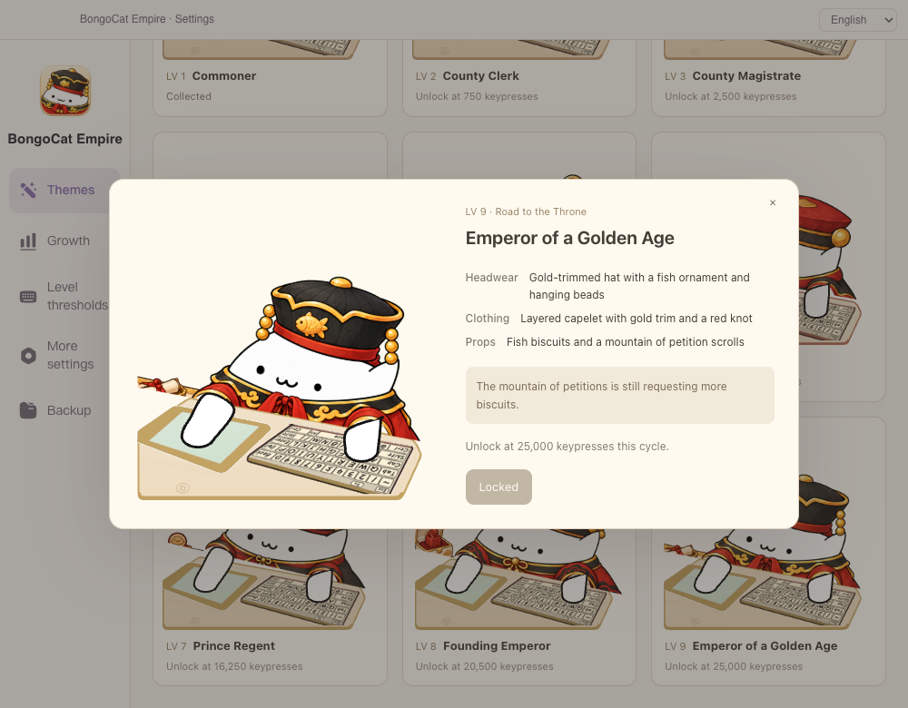

# BongoCat Empire

  

  

  <strong>把 MacBook 的每一次输入，养成一只会成长、会换装的桌面猫咪。</strong> 
  A desktop BongoCat for Mac with touchpad feedback, collectible growth, and 108 outfits.

  <a href="https://github.com/ankeyao-lab/BongoCat-Empire/releases/tag/v1.8.3">下载 v1.8.3</a> ·
  <a href="#安装">安装</a> ·
  <a href="#功能">功能</a> ·
  <a href="#致谢与许可">致谢</a>

## 功能

| 为 MacBook 触摸板设计                                                                        | 9 级称帝之路                                                                    |
| -------------------------------------------------------------------------------------------- | ------------------------------------------------------------------------------- |
|                       |            |
| 鼠标、触摸板移动、点击、拖拽和滚动，都会让右爪即时回到设备上。停止操作后，默认双爪自然举起。 | 每个主题都有 9 个等级。累计有效按键，即可解锁下一阶段、收藏装扮与新的成长轮次。 |

| 12 个主题，108 套装扮                                                       | 闲置姿势可以自己选                                                                             |
| --------------------------------------------------------------------------- | ---------------------------------------------------------------------------------------------- |
|             |                                     |
| 从原始外观、星际宇航、航海海盗到“称帝之路”，每条成长线都有完整的 9 级换装。 | 默认 A「举双爪」，也可切换 B「仅举左爪」。两种姿势都保留脸部和装扮的可见空间，设置会自动保存。 |

### 输入不止是按键动画

- **MacBook 触摸板联动**：右爪跟随触摸板/鼠标输入；点击、拖拽、滚动时保持接触，停止约 600 ms 后回到闲置姿态。
- **四种输入模式**：键盘＋触摸板、键盘＋鼠标、双手键盘、手柄。不同模式保留各自的爪位与按键反馈。
- **中英文即时切换**：界面可在简体中文与 English 间即时切换。
- **离线、本地保存**：无需账号和网络连接。成长进度、衣橱、阈值和偏好都保存在本机。

## 安装

适用于 Apple Silicon Mac（macOS 12 或更高版本）。

1. 在 [v1.8.3 Release](https://github.com/ankeyao-lab/BongoCat-Empire/releases/tag/v1.8.3) 下载 `BongoCat-Empire-1.8.3-macos-arm64.zip` 与 `SHA256SUMS.txt`。
2. 解压后将 **BongoCat Empire.app** 移至“应用程序”。
3. 首次打开时，前往「系统设置 → 隐私与安全性 → 输入监控」，允许 **BongoCat Empire** 读取输入事件，以启用键盘、触摸板、鼠标和滚动反馈。

安装包为本地 ad-hoc 签名，尚未公证。若 macOS 拦截首次启动，请在 Finder 中按住 Control 点击应用，再选择“打开”。下载页提供 SHA-256 校验文件。

## 版本与验证

当前版本为 **1.8.3**。已通过 TypeScript、32 项单元测试、5 项真实 Vue 输入回归、11 项中英文设置检查，以及 324 帧主题/姿态渲染检查。详见 [RELEASE_NOTES.md](RELEASE_NOTES.md)。

## 致谢与许可

BongoCat Empire 的核心代码基于 [ayangweb/BongoCat](https://github.com/ayangweb/BongoCat) 改造，并遵循其 [MIT License](LICENSE)。

项目中的猫咪模型与创作生态也受到 [ayangweb/Awesome-BongoCat](https://github.com/ayangweb/Awesome-BongoCat) 的启发；该仓库是 BongoCat 相关模型、工具与资源的重要目录。这里明确致谢两位上游项目及其贡献者。
